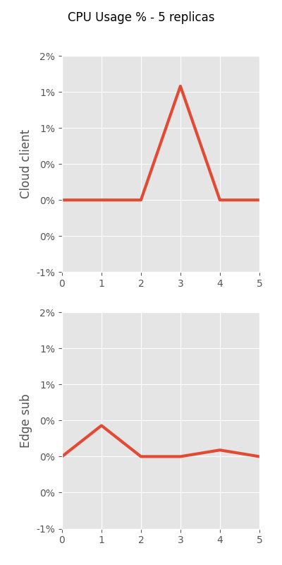
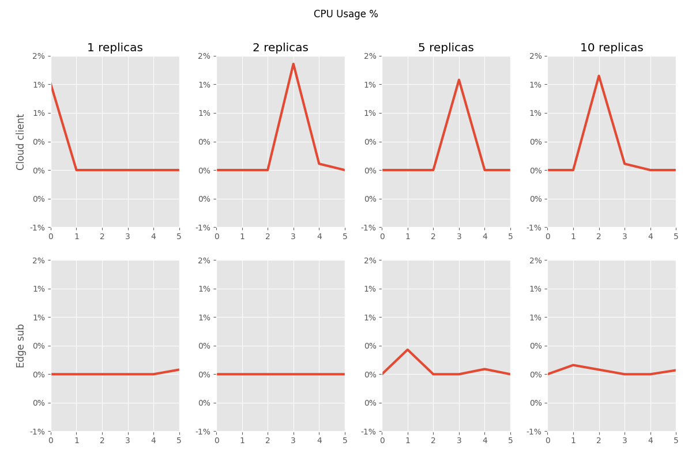

# [Resource Consumption Analyzer](https://github.com/debemdeboas/resource-consumption-analyzer)

This repository provides tools for analyzing `docker ps` logs, especially in cases where
Docker compose is being used with different replicas.

## Usage

The `analyze_container_resources.py` script is a [Typer](https://github.com/tiangolo/typer) CLI built to interface with users better than the original Jupyter notebook, although that's still available [here](./parse_logs.ipynb).
Both of these options require a `logs` directory that contains log files generated in a specific format: `docker stats --no-stream | cat >> $LOGS_DIR/logs_${amount}.csv`.
This is done automatically by the `gather_data.sh` script.[^1]

[^1]: This script requires a directory that contains a `docker-compose.yml` file that expects a `CLIENT_REPLICAS` environment variable to function correctly.

### Prerequisites

- Python 3.10+, pip
- Install via pip: `pip install -r requirements.txt`

### Calling the script

After installing the [required packages](#prerequisites) and running `gather_data.sh`, call the script like so (keep in mind that this is an example only - options may change!):

<div class="termy">

```console
$ python analyze_container_resources.py --help

 Usage: analyze_container_resources.py [OPTIONS] CONTAINERS

 Analyze container resource consumption

╭─ Arguments ───────────────────────────────────────────────────────────────────────────────────────╮
│ *    containers      TEXT  Name of the containers to analyze as a JSON dictionary of '{"NAME":    │
│                            "CONTAINER ID"}'                                                       │
│                            [default: None]                                                        │
│                            [required]                                                             │
╰───────────────────────────────────────────────────────────────────────────────────────────────────╯
╭─ Options ─────────────────────────────────────────────────────────────────────────────────────────╮
│ --logs-dir    -l      TEXT     Directory where the logs are stored [default: logs]                │
│ --output-dir  -o      TEXT     Directory where the output images will be saved [default: output]  │
│ --x-limit     -x      INTEGER  Maximum value for the x-axis. Usually this is your experiment      │
│                                duration in seconds                                                │
│                                [default: 120]                                                     │
│ --help                         Show this message and exit.                                        │
╰───────────────────────────────────────────────────────────────────────────────────────────────────╯
```

</div>

To generate graphs from logs such as these:

```log
CONTAINER ID   NAME                     CPU %     MEM USAGE / LIMIT     MEM %     NET I/O           BLOCK I/O   PIDS
328b071f5f96   edge_data_manager        0.00%     79.65MiB / 31.35GiB   0.25%     1.36kB / 670B     0B / 0B     31
e7c0a631d0e4   cloud_server             0.00%     83.28MiB / 31.35GiB   0.26%     1.52kB / 680B     0B / 0B     31
4d486730884a   cloud_broker             0.00%     88.35MiB / 31.35GiB   0.28%     2.12kB / 976B     0B / 0B     21
9812f5ab7068   edge_iot_smart_dev       0.12%     44.63MiB / 31.35GiB   0.14%     1.57kB / 0B       0B / 0B     21
dc7bd1822d60   case_2-edgeIoTDevSim-2   0.00%     48.85MiB / 500MiB     9.77%     1.71kB / 385B     0B / 0B     21
49ebd5f92636   cloud_client             0.00%     64.8MiB / 31.35GiB    0.20%     1.86kB / 670B     0B / 0B     21
dba3d8af9969   case_2-mongodb-1         0.28%     75.13MiB / 31.35GiB   0.23%     5.47kB / 3.53kB   0B / 0B     38
c53cdfebce2e   cloud_publisher          0.00%     47.14MiB / 31.35GiB   0.15%     1.53kB / 417B     0B / 0B     21
e0a0e0b87824   case_2-edgeIoTDevSim-1   0.00%     47.13MiB / 500MiB     9.43%     1.34kB / 417B     0B / 0B     21
336a9828040a   edge_subscriber          0.00%     47.14MiB / 31.35GiB   0.15%     1.61kB / 112B     0B / 0B     21
40771f1b9a18   edge_broker              0.00%     88.34MiB / 31.35GiB   0.28%     2.69kB / 2.09kB   0B / 0B     21
CONTAINER ID   NAME                     CPU %     MEM USAGE / LIMIT     MEM %     NET I/O           BLOCK I/O   PIDS
328b071f5f96   edge_data_manager        0.00%     79.65MiB / 31.35GiB   0.25%     1.4kB / 670B      0B / 0B     31
e7c0a631d0e4   cloud_server             0.00%     83.28MiB / 31.35GiB   0.26%     1.56kB / 680B     0B / 0B     31
4d486730884a   cloud_broker             0.00%     88.35MiB / 31.35GiB   0.28%     2.16kB / 976B     0B / 0B     21
9812f5ab7068   edge_iot_smart_dev       0.14%     44.77MiB / 31.35GiB   0.14%     1.68kB / 0B       0B / 0B     21
dc7bd1822d60   case_2-edgeIoTDevSim-2   0.30%     48.99MiB / 500MiB     9.80%     1.82kB / 595B     0B / 0B     21
49ebd5f92636   cloud_client             0.00%     64.8MiB / 31.35GiB    0.20%     1.97kB / 670B     0B / 0B     21
dba3d8af9969   case_2-mongodb-1         0.37%     77.46MiB / 31.35GiB   0.24%     8.04kB / 4.83kB   0B / 0B     39
c53cdfebce2e   cloud_publisher          0.00%     47.14MiB / 31.35GiB   0.15%     1.57kB / 417B     0B / 0B     21
e0a0e0b87824   case_2-edgeIoTDevSim-1   0.00%     47.13MiB / 500MiB     9.43%     1.38kB / 417B     0B / 0B     21
336a9828040a   edge_subscriber          0.00%     47.32MiB / 31.35GiB   0.15%     2.12kB / 648B     0B / 0B     21
40771f1b9a18   edge_broker              0.22%     88.37MiB / 31.35GiB   0.28%     4.74kB / 5kB      0B / 0B     21
CONTAINER ID   NAME                     CPU %     MEM USAGE / LIMIT     MEM %     NET I/O           BLOCK I/O   PIDS
328b071f5f96   edge_data_manager        0.25%     79.65MiB / 31.35GiB   0.25%     1.91kB / 986B     0B / 0B     31
e7c0a631d0e4   cloud_server             0.24%     83.28MiB / 31.35GiB   0.26%     2.11kB / 972B     0B / 0B     31
4d486730884a   cloud_broker             0.00%     88.35MiB / 31.35GiB   0.28%     2.88kB / 1.36kB   0B / 0B     21
9812f5ab7068   edge_iot_smart_dev       0.12%     44.86MiB / 31.35GiB   0.14%     1.68kB / 0B       0B / 0B     21
dc7bd1822d60   case_2-edgeIoTDevSim-2   0.00%     48.99MiB / 500MiB     9.80%     1.89kB / 595B     0B / 0B     21
49ebd5f92636   cloud_client             0.00%     64.81MiB / 31.35GiB   0.20%     2.4kB / 986B      0B / 0B     21
dba3d8af9969   case_2-mongodb-1         0.33%     77.47MiB / 31.35GiB   0.24%     10.1kB / 7.23kB   0B / 0B     39
c53cdfebce2e   cloud_publisher          0.00%     47.22MiB / 31.35GiB   0.15%     1.71kB / 629B     0B / 0B     21
e0a0e0b87824   case_2-edgeIoTDevSim-1   0.00%     47.28MiB / 500MiB     9.46%     1.51kB / 627B     0B / 0B     21
336a9828040a   edge_subscriber          0.00%     47.32MiB / 31.35GiB   0.15%     2.19kB / 746B     0B / 0B     21
40771f1b9a18   edge_broker              0.00%     88.37MiB / 31.35GiB   0.28%     5.63kB / 5.92kB   0B / 0B     21
```

Call the script like so, assuming that these logs are in the `logs` directory and that you want to analyze only the `cloud_client` and `edge_subscriber` containers sampling a duration of 10 seconds:

<div class="termy">

```console
$ python analyze_container_resources.py '{"Cloud client": "cloud_client", "Edge sub": "edge_subscriber"}' -x 10
```

</div>

This will call the script and generate a few images with everything that it could collect from the logs, e.g. the number of replicas.
The generated images will be located at the output directory, split by replicas, and with an `all` directory as well.
This is where all replicas are put into one single image for ease of comparison.

|                   5 replicas                    |                  all replicas                   |
| :---------------------------------------------: | :---------------------------------------------: |
|  |  |